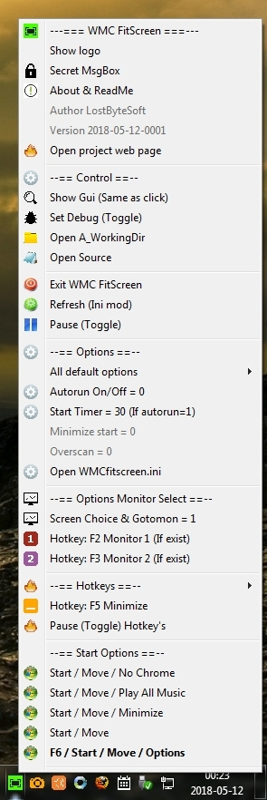

* Windows Media Center Fit Screen. Best fit for WMC without full screen.

This software is usefull to place automaticly WMC for best fit.

On monitor 1 or 2. All files must be in same folder. Where you want.

Ajusted resolutions: 1366 x 768 1600 x 900  1680 x 1050  1920 x 1080.

Windows 7 maybe intermix monitor numbers ; ex: the 2 is primary and 1 is extended. This software not supposed to have unexpected random errors with that.

* Installation

Juste put all the files in the same directory.

* --- To do list ---
 
2017-10-09-1936 Put WMC full screen in one screen and do not grab the mouse. (I made it on 2018-05-12-0026) Active option overscan on screen 2.

* Screen shot (menu tray)

